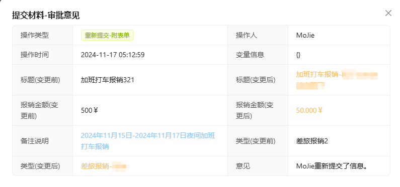

---
group:
    title: API
    order: 2
toc: content
title: Instance
order: 3
---
:::info{title=Tips}
Process Instance APIs：EasyProcessInstanceService
:::

## 1、Start Process Instance
`startProcessInstanceByKey(param)`：After deploying the process, process definition information will appear. 
The process can be started using the process definition ID, making it easy to specify which process to start. 
If not, the process identification ID will be used, and the latest version of the definition will be started by default.

**startup params**

|     props      | description                                                                                                                | type        | required                                         |
|---------------------|----------------------------------------------------------------------------------------------------------------------------|-----------------------|--------------------------------------------------|
| flowKey             | -                                                                                                                          | `String`              | `Choose between flowKey and processDefinitionId`            |
| processDefinitionId | -                                                                                                                          | `String`              | `Choose between flowKey and processDefinitionId` |
| businessKey         | -                                                                                                                          | `String`              | `true`                                           |
| startUserId         | The initiator of the process will not transmit the information obtained using EasyUserService.getCurrentUser               | `String`              | `false`                                          |
| startUsername       | -                                                                                                                          | `String`              | `false`                                          |
| variables           | Process variable (global, until the end of the process), the initiator process initiator variable will be added by default | `Map<String, Object>` | `false`                                          |
| processName         | -                                                                                                                          | `String`              | `true`                                           |
| skipFirstNode       | Do you want to skip the start node (startEnvent ->userTask)                                                                                   | `boolean`             | `false`                                          |
| startFormData       | 是No is the form process (usually when true, skipFirstNode needs to be set to true)                                                                                   | `boolean`             | `false`   |
| formData            | Submit information, which will be recorded in the first user node. The submitted information is usually the entity of the business table. Easy Flowable provides @ EasyItem to record the detailed information of the submission, and compares the value changes when resubmitting | `Object` | `false`          |

### Form submission case

## 2、Get instance list

### 2.1、Obtain based on process identification
`getFlowInstanceListByKey(flowKey)`
### 2.2、Process definitionId acquisition
`getFlowInstanceListByKey(processDefinitionId)`

### 2.3、Obtain process instance single instance based on business primary key
`getProcessInstanceByBusinessKey(businessKey)`

Example list returns results：

|     props      | description                                                                               | type        |
|------------------------|-------------------------------------------------------------------------------------------|-----------|
| processInstanceId      | -                                                                                         | `String`  |
| processDefinitionId    | -                                                                                         | `String`  |
| startTime              | -                                                                                         | `Date`    |
| startUserId            | -                                                                                         | `String`  |
| status                 | Process instance status: true terminated, false activated                                 | `boolean` |
| businessKey            | -                                                                                         | `String` |
| name                   | -                                                                                         | `String` |
| tenantId               | -                                                                                         | `String`    |
| businessKeyStatus      | [业务状态设置](#3、Set business status)                                                          | `String`    |
| deploymentId           | -                                                                                         | `String`    |
| processInstanceVersion | -                                                                                         | `Integer`    |
| taskId                 | -                                                                                         | `String`    |
| taskIds                | Multiple task IDs separated by commas (multiple instances/exclusive gateways may appear)  | `String`    |

## 3、Set business status
`updateProcessInstanceBusinessStatus(processInstanceId, status)`
- Set the process status through the process instance ID, customize the status, and default to `start` when the process starts

## 4、User task nodes that can be rolled back during the execution process
`getFlowBackUserTasks(processInstanceId)`: When the process needs to return to a certain node, 
the executed nodes can be retrieved through this interface for rollback

## 5、Retrieve process execution history
`getFlowExecutionHistoryList(processInstanceId)`

List returns results：

|     props      | description | type        |
|---------------------|-------------|------------------|
| historyId           | -           | `String`         |
| taskId              | -           | `String`         |
| executionId         | -           | `String`         |
| taskName            | -           | `String`         |
| taskDefKey          | -           | `boolean`        |
| processDefinitionId | -           | `String`         |
| procInsId           | -           | `String`         |
| duration            | -           | `Long`           |
| startTime           | -           | `Date`           |
| endTime             | -           | `Date`           |
| assignee            | -           | `String`         |
| candidateUsers      | -           | `List<String>`   |
| candidateGroups     | -           | `List<String>`   |
| comments            | -           | [comments](#Approval Opinion)   |

## 6、Modify instance status
`updateProcessInstanceState(String processInstanceId)`: List returns results

## 7、Retrieve the KEY of the previous user task node based on the process instance ID
`getUpNodeKey(processInstanceId)`: Get the previous task nodeId

## 8、Current process dynamics
`processDynamics(processInstanceId, processDefinitionId)`

|     props      | description            | type        |
|-------------|------------------------|----------------|
| data        | Process deployment XML | `String`       |
| activeNode  | Current active node    | `List<String>` |
| executeNode | Process executed node  | `List<String>` |

## 9、Obtain node execution information based on nodeId
`nodeInfo(nodeId)`: Obtain information on the most recent node execution

|     props      | description | type        |
|-----------|-------------|-------------|
| startTime | -           | `String`    |
| endTime   | -           | `String`    |
| duration  | -           | `long`      |
| users     | -           | [user[]](#UserInfo) |

## 10、Process statistics
`statics`: Count the number of pending and completed tasks

|     props      | description | type        |
|---------|-------------|-----------|
| todo    | -           | `long` |
| done    | -           | `long`  |
| meTodo  | -           | `long`    |
| meDone  | -           | `long`    |

## 11、To do pagination query
`todoTasksByUser(userId, current, size)`

|     props      | description                                               | type        |
|-------------------|-----------------------------------------------------------|---------------|
| id                | -                                                         | `String`      |
| status            | Process status: 0 in progress. 1 completed, 2 invalidated | `Integer`     |
| processName       | -                                                         | `String`      |
| nodeName          | -                                                         | `String`      |
| startTime         | -                                                         | `Date`        |
| assignee          | -                                                         | `String`      |
| startUserId       | -                                                         | `String`      |
| taskId            | -                                                         | `String`      |
| processInstanceId | -                                                         | `String`      |
| comments          | -                                                         | [comments](#Approval Opinion) |

## 12、Completed pagination query
`doneTasksByUser(userId, current, size)`

|     props      | description                                               | type        |
|-------------------|-----------------------------------------------------------|---------------|
| id                | -                                                         | `String`      |
| status            | Process status: 0 in progress. 1 completed, 2 invalidated | `Integer`     |
| processName       | -                                                         | `String`      |
| nodeName          | -                                                         | `String`      |
| startTime         | -                                                         | `Date`        |
| endTime           | -                                                         | `Date`        |
| assignee          | -                                                         | `String`      |
| startUserId       | -                                                         | `String`      |
| taskId            | -                                                         | `String`      |
| processInstanceId | -                                                         | `String`      |
| comments          | -                                                         | [comments](#Approval Opinion) |

## UserInfo

|     props      | description | type        |
|----------|-------------|---------|
| userId   | -           | `String` |
| username | -           | `String` |
| avatar   | -           | `String` |
| email    | -           | `String`  |
| originId | -           | `String`  |

## Approval Opinion

|     props      | description                                               | type        |
|-------------------|-----------------------------------------------------------|---------|
| commentId         | -                                                         | `String` |
| processInstanceId | -                                                         | `String` |
| taskId            | -                                                         | `String` |
| flowCommentType   | -                                                         | `String`  |
| assignee          | -                                                         | `String`  |
| assigneeName      | -                                                         | `String`  |
| userId            | Delegate/Transferor                                       | `String`  |
| commentContent    | Approval Opinion                                          | `String`  |
| attachmentId      | -                                                         | `String`  |
| variables         | -                                                         | `Map<String, Object>`  |
| ext               | Additional information: Form information is recorded here | `String`  |
| commentTime       | -                                                         | `Date`  |
