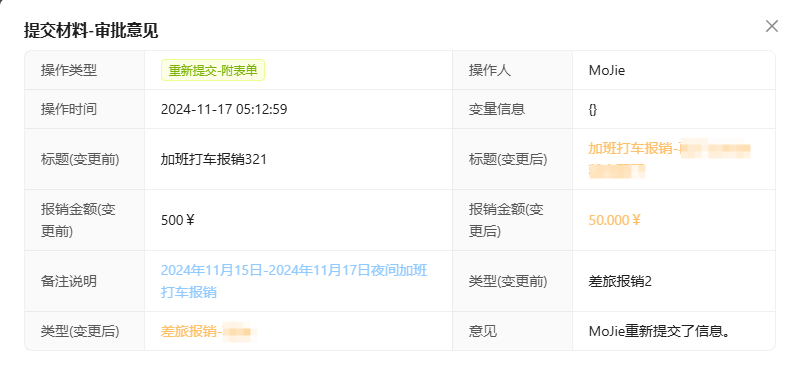

---
group:
    title: API
    order: 2
toc: content
title: 流程实例(ProcessInstance)
order: 3
---
:::info{title=小提示}
流程实例对应接口：EasyProcessInstanceService。
flowable本身接口仍然可以使用，正常注入即可使用原生API
:::

## 1、启动流程实例
`startProcessInstanceByKey(param)`：将流程部署后，会出现流程定义信息，可通过流程定义ID启动流程，方便指定启动哪个流程，如果没有则使用流程标识ID，默认启动最新版本的定义。

**启动参数**

| 属性名                 | 描述                                                                              | 类型                    | 是否必须                      |
|---------------------|---------------------------------------------------------------------------------|-----------------------|---------------------------|
| flowKey             | 流程标识                                                                            | `String`              | `与processDefinitionId二选一` |
| processDefinitionId | 流程定义ID                                                                          | `String`              | `与flowKey二选一`             |
| businessKey         | 业务主键                                                                            | `String`              | `true`                    |
| startUserId         | 流程发起人，不传递会使用EasyUserService.getCurrentUser获取的信息                                 | `String`              | `false`                   |
| startUsername       | 流程发起人姓名                                                                         | `String`              | `false`                   |
| variables           | 流程变量(全局，直到流程结束)，默认会追加initiator流程发起人变量                                           | `Map<String, Object>` | `false`                   |
| processName         | 流程名称                                                                            | `String`              | `true`                    |
| skipFirstNode       | 是否跳过开始节点(startEnvent->userTask（提交审核资料）)                                         | `boolean`             | `false`                   |
| startFormData       | 是否为表单流程(一般为true时需要将skipFirstNode设置为true)                                        | `boolean`             | `false`                   |
| formData            | 提交信息，会记录到第一用户节点中，提交的信息一般为业务表的实体，easy-flowable提供了@EasyItem来记录提交的详细信息，在重新提交时比较值变化 | `Object`              | `false`                   |

### 表单提交案例

## 2、获取实例列表

### 2.1、根据流程标识获取
`getFlowInstanceListByKey(flowKey)`
### 2.2、流程定义ID获取
`getFlowInstanceListByKey(processDefinitionId)`

### 2.3、根据业务主键获取流程实例-单实例
`getProcessInstanceByBusinessKey(businessKey)`

实例列表返回结果：

| 属性名                    | 描述                      | 类型        |
|------------------------|-------------------------|-----------|
| processInstanceId      | 流程实例ID                  | `String`  |
| processDefinitionId    | 流程定义ID                  | `String`  |
| startTime              | 流程启动时间                  | `Date`    |
| startUserId            | 流程发起人                   | `String`  |
| status                 | 流程实例状态true终止，false激活    | `boolean` |
| businessKey            | 业务主键                    | `String` |
| name                   | 流程实例名称                  | `String` |
| tenantId               | 租户id                    | `String`    |
| businessKeyStatus      | 业务状态，[业务状态设置](#3、设置业务主键状态)        | `String`    |
| deploymentId           | 部署ID                    | `String`    |
| processInstanceVersion | 流程实例运行版本                | `Integer`    |
| taskId                 | 当前运行的任务ID               | `String`    |
| taskIds                | 逗号分割的多个任务ID(多实例/排他网关会出现) | `String`    |

## 3、设置业务主键状态
`updateProcessInstanceBusinessStatus(processInstanceId, status)`
- 通过流程实例ID设置流程状态，状态自定义，在流程启动时默认为`start`

## 4、执行流程可回退的用户任务节点
`getFlowBackUserTasks(processInstanceId)`: 当需要流程回到某个节点时，可通过该接口获取已执行过的节点进行回退

## 5、获取流程执行历史记录
`getFlowExecutionHistoryList(processInstanceId)`

列表返回结果：

| 属性名                 | 描述           | 类型               |
|---------------------|--------------|------------------|
| historyId           | 执行历史ID       | `String`         |
| taskId              | 执行任务ID       | `String`         |
| executionId         | 任务执行编号       | `String`         |
| taskName            | 任务名称         | `String`         |
| taskDefKey          | 任务Key(节点key) | `boolean`        |
| processDefinitionId | 流程定义ID       | `String`         |
| procInsId           | 流程实例ID       | `String`         |
| duration            | 节点执行耗时(毫秒)   | `Long`           |
| startTime           | 任务开始时间       | `Date`           |
| endTime             | 任务完成时间       | `Date`           |
| assignee            | 节点执行人        | `String`         |
| candidateUsers      | 节点候选人        | `List<String>`   |
| candidateGroups     | 节点候选组        | `List<String>`   |
| comments            | 流程审批意见       | [comments](#流程审批意见)   |

## 6、修改实例状态
`updateProcessInstanceState(String processInstanceId)`: 如果激活就终止，如果终止就激活

## 7、根据流程实例ID获取上一个用户任务节点KEY
`getUpNodeKey(processInstanceId)`: 获取上一任务节点id

## 8、当前流程动态
`processDynamics(processInstanceId, processDefinitionId)`
- 流程实例ID+流程定义ID获取

| 属性名         | 描述       | 类型             |
|-------------|----------|----------------|
| data        | 流程部署xml  | `String`       |
| activeNode  | 当前活动节点   | `List<String>` |
| executeNode | 流程已执行节点  | `List<String>` |

## 9、根据节点ID获取节点执行信息
`nodeInfo(nodeId)`: 得到最近一次节点执行的信息

| 属性名       | 描述      | 类型          |
|-----------|---------|-------------|
| startTime | 任务开始时间  | `String`    |
| endTime   | 任务完成时间  | `String`    |
| duration  | 任务耗时(秒) | `long`      |
| users     | 执行用户信息  | [user[]](#用户信息) |

## 10、流程统计数
`statics`: 统计待办和已办数量

| 属性名     | 描述   | 类型        |
|---------|------|-----------|
| todo    | 待办数量 | `long` |
| done    | 已办   | `long`  |
| meTodo  | 我的待办 | `long`    |
| meDone  | 我的已办 | `long`    |

## 11、待办分页查询
`todoTasksByUser(userId, current, size)`
- userId：用户id，全部待办不查询
- current：页码
- size：页数大小

| 属性名               | 描述                 | 类型            |
|-------------------|--------------------|---------------|
| id                | 办理历史ID             | `String`      |
| status            | 流程状态：0进行中。1完成，2已作废 | `Integer`     |
| processName       | 流程名称               | `String`      |
| nodeName          | 节点名称               | `String`      |
| startTime         | 任务开始时间             | `Date`        |
| assignee          | 代办人                | `String`      |
| startUserId       | 任务发起人              | `String`      |
| taskId            | 任务ID               | `String`      |
| processInstanceId | 流程实例ID             | `String`      |
| comments          | 流程审批意见             | [comments](#流程审批意见) |

## 12、已办分页查询
`doneTasksByUser(userId, current, size)`
- userId：用户id，全部待办不查询
- current：页码
- size：页数大小

| 属性名               | 描述                 | 类型            |
|-------------------|--------------------|---------------|
| id                | 办理历史ID             | `String`      |
| status            | 流程状态：0进行中。1完成，2已作废 | `Integer`     |
| processName       | 流程名称               | `String`      |
| nodeName          | 节点名称               | `String`      |
| startTime         | 任务开始时间             | `Date`        |
| endTime           | 任务结束时间             | `Date`        |
| assignee          | 代办人                | `String`      |
| startUserId       | 任务发起人              | `String`      |
| taskId            | 任务ID               | `String`      |
| processInstanceId | 流程实例ID             | `String`      |
| comments          | 流程审批意见             | [comments](#流程审批意见) |

## 用户信息

| 属性名      | 描述     | 类型      |
|----------|--------|---------|
| userId   | 用户ID   | `String` |
| username | 用户名    | `String` |
| avatar   | 用户头像   | `String` |
| email    | 电子邮箱   | `String`  |
| originId | 所属部门ID | `String`  |

## 流程审批意见

| 属性名               | 描述              | 类型      |
|-------------------|-----------------|---------|
| commentId         | 评论ID            | `String` |
| processInstanceId | 流程实例ID          | `String` |
| taskId            | 任务ID            | `String` |
| flowCommentType   | 流程类型            | `String`  |
| assignee          | 审批人             | `String`  |
| assigneeName      | 审批人姓名           | `String`  |
| userId            | 委派/转办人          | `String`  |
| commentContent    | 审批意见            | `String`  |
| attachmentId      | 附件ID            | `String`  |
| variables         | 审批变量            | `Map<String, Object>`  |
| ext               | 拓展信息: 表单信息记录在这里 | `String`  |
| commentTime       | 评论时间            | `Date`  |
