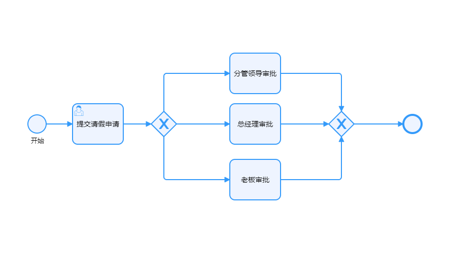
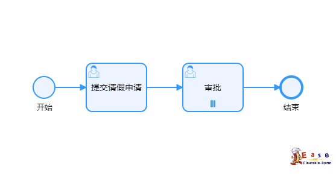

## UserTask
<Badge type="info">The user task only requires manual approval to modify nodes</Badge>
|            parameter          |               description               |
|--------------------------------------------------------|---------------------------------|
| assignee | Single user: Only one user executes |
| candidateUsers | Candidate user: Multiple users can perform the task, but only one person can perform it |
| candidateGroups | Candidate group: It can be a role group or a department group, and there are many users under one group who need to customize and expand |

## Multi-instance

|            参数          |               说明               |
|--------------------------------------------------------|---------------------------------|
| loopCharacteristics.collection | List of Executors(${assigneeList}) |
| loopCharacteristics.completionCondition.body | Complete expression |
| loopCharacteristics.loopCardinality | When using a loop instance, the number of loops and the number type cannot be less than 2 times |

### Sequential
:::info{title=Single instance mode Sequential}
The execution order is not specified, and after all executions are completed, it enters the aggregation gateway
:::

:::info{title=Multi instance mode Sequential}
The execution order is not in any particular order, and after all executions are completed, it enters the aggregation gateway. The completion condition can be set by completing the expression through perfectionCondition
:::

### 并行
:::info{title=Single instance mode parallel}
The execution sequence follows the flowchart sequence, and ends after all executions are completed
:::

:::info{title=Parallel multi instance mode}
The execution sequence follows the flowchart sequence, and the list of executors executes the current task in order. After all tasks are completed, it ends. The completion condition can be set through the completion condition expression
:::

## ServiceTask
## EmailTask
## ScriptTask
