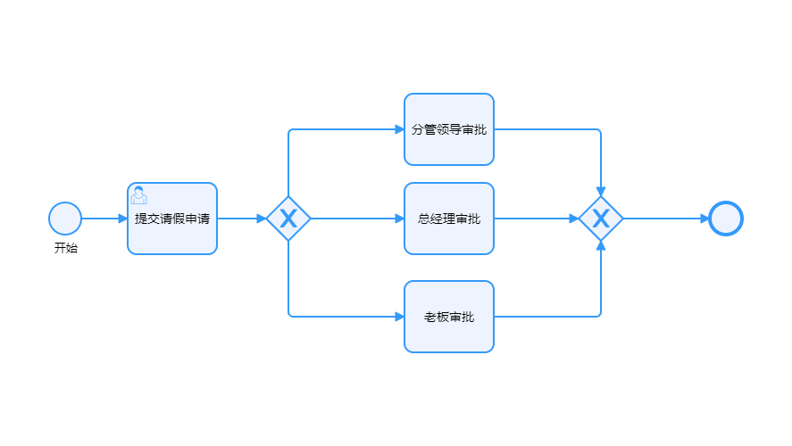
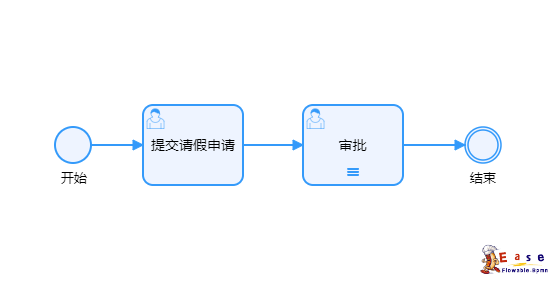
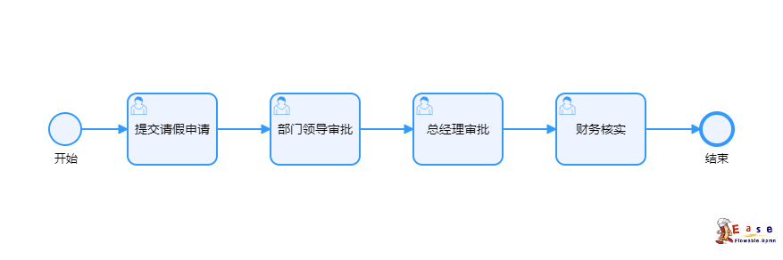
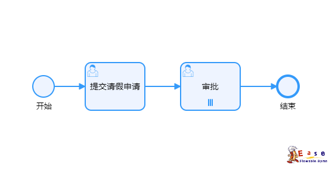
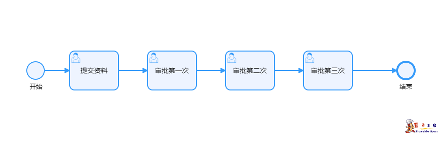
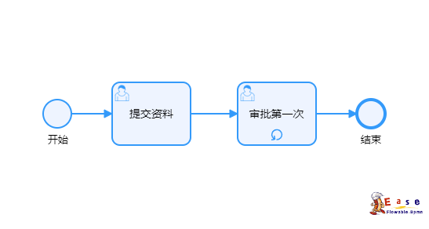

## 用户任务(UserTask)
<Badge type="info">用户任务只的是改节点需要人工审批</Badge>
|            参数          |               说明               |
|--------------------------------------------------------|---------------------------------|
| assignee | 单个用户：只有一个用户执行 |
| candidateUsers | 候选用户：多个用户都可以执行该任务，但只能一个人执行 |
| candidateGroups | 候选组：可以是角色组，也可以是部门组，一个组下有很多个用户需要自定义拓展 |

## 多实例

|            参数          |               说明               |
|--------------------------------------------------------|---------------------------------|
| loopCharacteristics.collection | 执行人列表(为流程变量配置为${assigneeList}) |
| loopCharacteristics.completionCondition.body | 完成表达式，[具体说明点击查看](../Expression/index.md#完成条件表达式) |
| loopCharacteristics.loopCardinality | `循环实例用到，循环次数，number类型不能小于2次` |

### 串行
:::info{title=单实例模式串行}
执行顺序不分先后，全部执行完成后进入汇集网关
:::

:::info{title=多实例模式串行}
执行顺序不分先后，全部执行完成后进入汇集网关，可通过completionCondition完成表达式设置完成条件
:::

### 并行
:::info{title=单实例模式并行}
执行顺序按照流程图顺序执行，全部执行完成后结束
:::

:::info{title=多实例模式并行}
执行顺序按照流程图顺序执行，执行人列表list按顺序执行当前任务，全部完成后结束，可通过completionCondition完成表达式设置完成条件
:::

### 循环
:::info{title=单实例模式循环}
执行顺序按照流程图顺序执行，全部执行完成后结束
:::

## 服务任务
:::info{title=多实例模式循环}
执行一个任务n次，达到执行次数后结束循环,需要设置参数loopCharacteristics.loopCardinality为需要循环的次数
:::

## 服务任务
## 邮件任务
## 脚本任务
